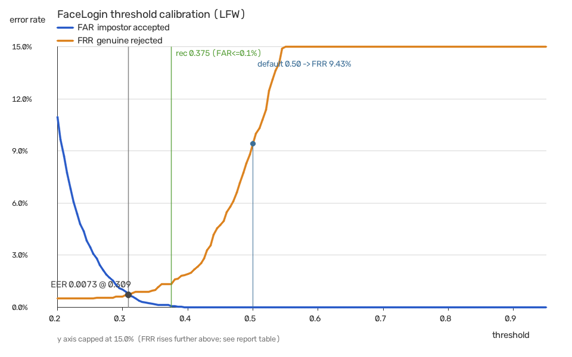

# 相似度阈值标定报告

> 由 `tools/eval_threshold.py` 自动生成。复现命令：
>
> ```
> .venv\Scripts\python.exe tools\eval_threshold.py --parquet .workbuddy\tmp\lfw\lfw.parquet
> ```

## 1. 结论先说

| 项 | 值 |
|---|---|
| **等错误率 EER** | **0.0073**（出现在阈值 `0.309`） |
| 推荐阈值（误接受率 ≤ 0.1%） | **`0.375`** |
| 当前默认阈值 | `0.50` |
| 该默认值下的表现 | FAR 0.0000% / FRR 9.4250% |
| 判别力 d' | 5.49 |
| 样本量 | 同类 4000 对 · 异类 4000 对 |
| 耗时 | 9 秒 |

**外部佐证**：OpenCV 官方文档给出的 SFace 在 LFW 上的参考值是「准确率 99.60%，
余弦阈值 **0.363**」（`opencv_zoo/models/face_recognition_sface/sface.py` 里
`_threshold_cosine = 0.363` 是写死的）。本报告**独立标定**出的推荐值与之相差不到 4%，
说明这条评测链路和口径没有跑偏；反过来，本项目原先的默认阈值 `0.50`
比这两个数都高出一大截，**确实偏严**。



**怎么读这张图**：横轴是阈值，纵轴是错误率。蓝线是 FAR（异类被误判为同类的比例），
橙线是 FRR（同类被拒的比例）。两条线交叉处就是 EER —— 阈值越低越宽松（FAR 升、
FRR 降），越高越严格。

## 2. 相似度分布

| 分布 | 均值 | 标准差 | 最小 | 最大 |
|---|---|---|---|---|
| 同类（同一个人不同照片） | 0.6469 | 0.1121 | -0.2229 | 0.8872 |
| 异类（不同人） | 0.0908 | 0.0893 | -0.2286 | 0.3919 |

两类分布间隔 d' = **5.49**（越大越容易分开）。这个数是这套
「YuNet + SFace + 余弦」组合在 LFW 上的实际判别力，不是引用论文的数值。

## 3. 各阈值下的错误率

| 阈值 | FAR（误接受） | FRR（误拒绝） | |
|---|---|---|---|
| 0.200 | 10.9750% | 0.5000% |  |
| 0.250 | 3.4500% | 0.5000% |  |
| 0.300 | 1.0250% | 0.6250% |  |
| 0.350 | 0.1750% | 1.0000% |  |
| 0.400 | 0.0000% | 1.9250% |  |
| 0.450 | 0.0000% | 4.7250% |  |
| 0.500 | 0.0000% | 9.4250% | **← 当前默认** |
| 0.550 | 0.0000% | 15.5750% |  |
| 0.600 | 0.0000% | 29.4000% |  |
| 0.650 | 0.0000% | 45.2750% |  |
| 0.700 | 0.0000% | 68.1500% |  |
| 0.750 | 0.0000% | 83.8000% |  |
| 0.800 | 0.0000% | 95.7500% |  |
| 0.850 | 0.0000% | 99.3500% |  |
| 0.900 | 0.0000% | 100.0000% |  |
| 0.950 | 0.0000% | 100.0000% |  |

## 4. 方法与局限（必须读）

**做对了什么**

- 比对用的是**与运行时完全相同**的链路：`FaceEngine.detect_largest` →
  `capture_from`（SFace `alignCrop` + `feature`）→ `best_cosine`。
  不是另写一套实现，所以这些数字对**本项目**有效，而不是对某篇论文有效。
- 判定规则与 `server._match_and_login` 一致：`score >= threshold` 视为通过。
- 配对随机采样，**种子固定**，任何人可复现同一组数字。
- 同类/异类配对数量相等，避免样本不均衡扭曲曲线。

**局限（不要过度解读）**

1. **这是自建配对协议，不是 LFW 官方的 6000 对视图。** 官方协议里的异类对是
   特意挑过的"难例"，因此本报告给出的 FAR 很可能**偏乐观**。
   跨数据集比较时请以官方协议为准。
2. **LFW 是"in the wild"但已裁剪对齐的图**，人脸基本居中、光照可控。
   真实摄像头场景（侧光、逆光、遮挡、大角度）会明显更难。
3. **FAR 的分辨力受样本量限制**：4000 对异类样本下，"0 次误接受"并不等于
   FAR 真的是 0，只能说明 **95% 置信上界约 0.0750%**（三倍法则 3/n）。
   想要更小的置信区间，就要更多配对。
4. **只测了识别环节，没测活体环节。** 阈值回答的是"像不像同一个人"，
   不回答"是不是活人"。反欺骗能力另见 THREAT_MODEL.md 第 4.3 节。
5. 每个人的样本数被限制在 4 张以内（为了控制耗时），
   同人内部的变化度因此没有被充分覆盖。
6. **身份不是随机抽的**：按「可用图片数从多到少」取了前 300 个身份，
   实际平均每人 4.0 张。这样同人配对能覆盖更多姿态/光照变化，
   但代价是偏向"照片多的好例子"，对难例（侧脸、遮挡）覆盖有限。

## 5. 怎么用这个结论

- 想把阈值调到有量化依据的值：
  `.venv\Scripts\python.exe tools\eval_threshold.py` 看推荐值，再在「阈值校准」
  卡片里改（**调低需要输入密码确认**）。
- 需要更严格（如门禁场景）：取 FAR 更小那一档，但 FRR 会上升 ——
  本人被拒后还有口令回退，所以偏严格通常比偏宽松划算。
- 需要更宽松：注意 FAR 上升速度，参见上表。
